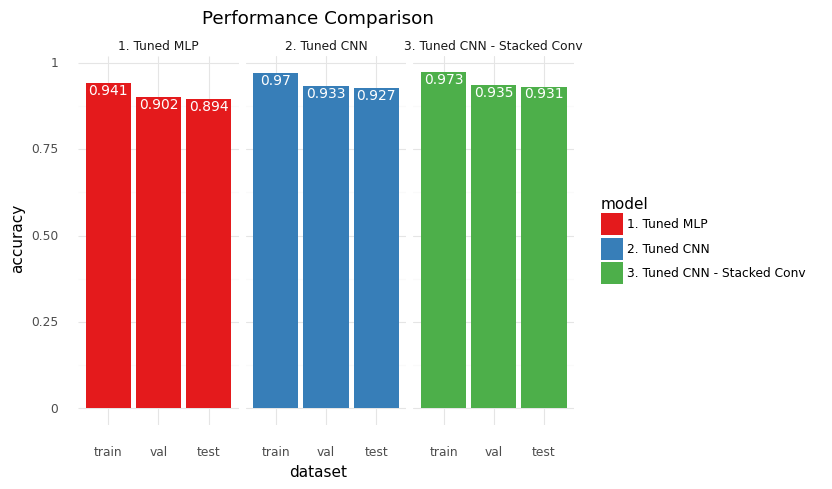

# clothing-images-classification-CNN

This repository was an assignment for the course `Deep Learning` during my MSc Data Science studies in Athens University of Economics and Business (AUEB). It is a multiclass classification task, using the Fashion-MNIST dataset from Zalando. In detail, the task is to classify images of clothing to the respective category. The labels are:

* 0: T-shirt/top
* 1: Trouser
* 2: Pullover
* 3: Dress
* 4: Coat
* 5: Sandal
* 6: Shirt
* 7: Sneaker
* 8: Bag
* 9: Ankle boot

The purpose of the assignment is to develop some deeper intuition on how the architectures of the network, as well as its hyperparameters such as the learning rate, activation functions and dropout rate can impact the learning process and the performance.

In the notebook attached, I am evaluating the impact of:

* Different activation functions, such as `sigmoid`, `ReLU` and `tanh`
* Different optimizers, such as `Adam`, `SGD`, `SGD with momentum`
* Additional complexity in the form of more hidden layers
* Additional complexity in the form of higher number of activation units
* Different architectures, such as `Deep Multilayer Perceptrons`, `CNN`, `Stacked CNN`, `Stacked CNN with Residual Connections`.

After tuning the hyperparameters of the three major architectures, namely a `Multilayer Perceptron`, a `Stacked CNN` and a `Stacked CNN using Residual Connections`, one can observe that the latter outperforms the other two, using the `accuracy` score as the evaluation metric.

Feel free to go through the jupyter notebook and in case you need a more compact form of the results, check the `deep_learning_report.pdf`